<table align="center">
  <tr>
    <td align="center">
      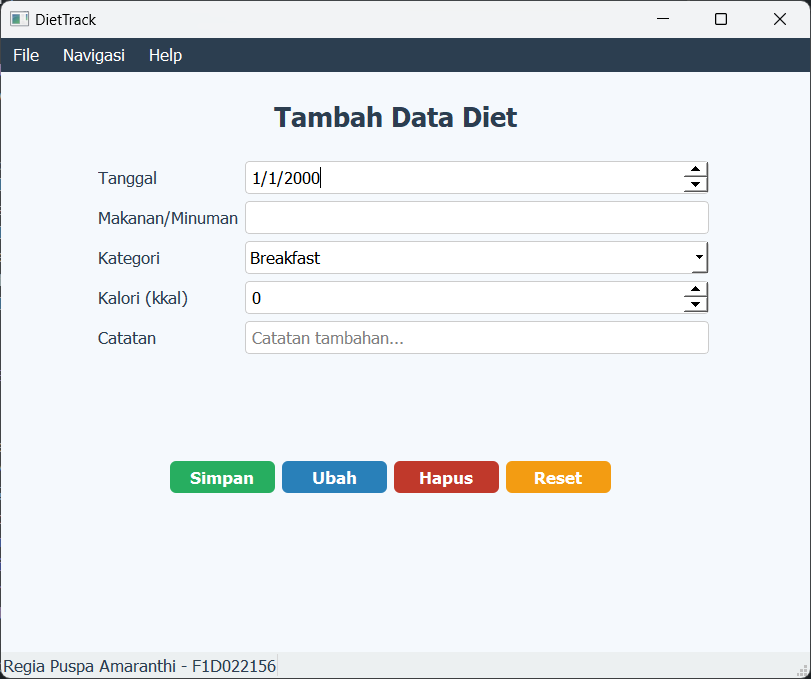 
      <b>Tampilan Awal Aplikasi</b>
    </td>
    <td align="center">
      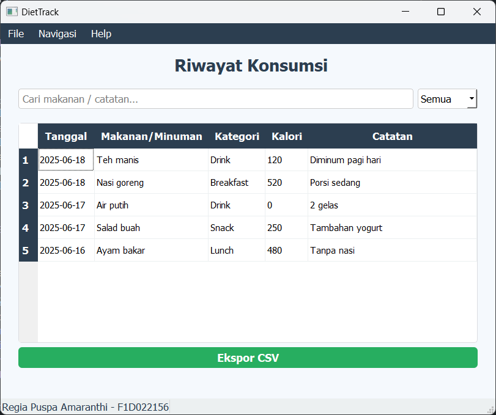 
      <b>Tampilan Riwayat Konsumsi</b>
    </td>
  </tr>
  <tr>
    <td align="center">
      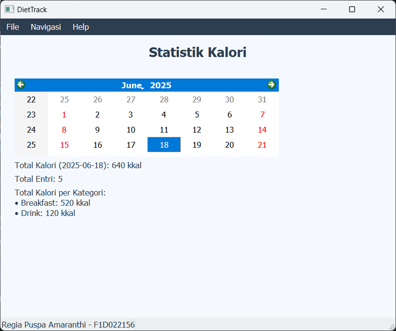 
      <b>Tampilan Statistik Kalori</b>
    </td>
    <td align="center">
      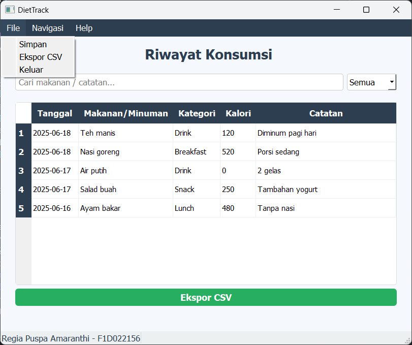 
      <b>MenuBar File</b>
    </td>
  </tr>
  <tr>
    <td align="center">
      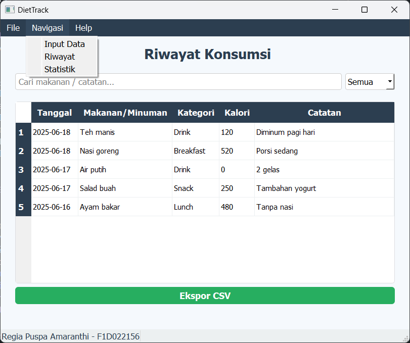 
      <b>MenuBar Navigasi</b>
    </td>
    <td align="center">
      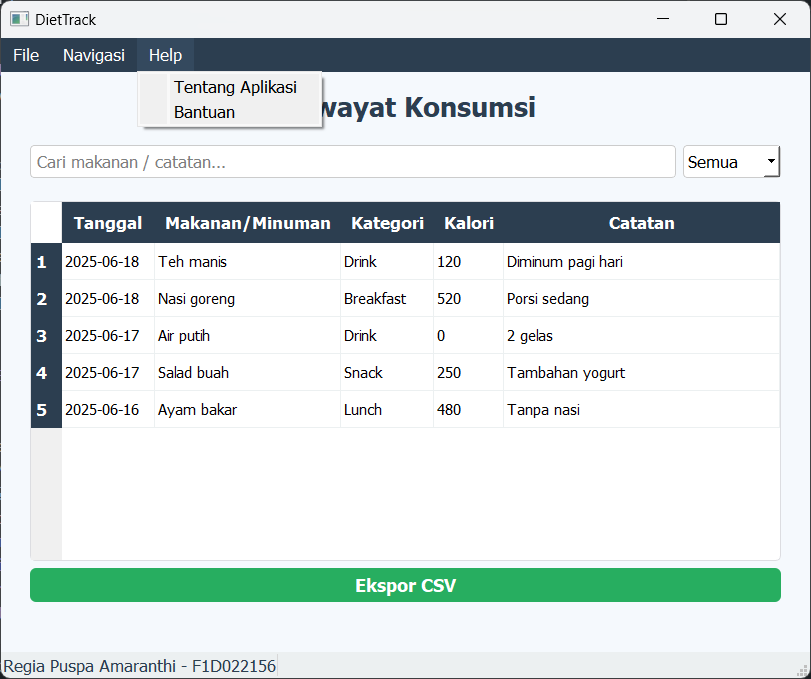 
      <b>MenuBar Help</b>
    </td>
  </tr>
  <tr>
    <td align="center">
      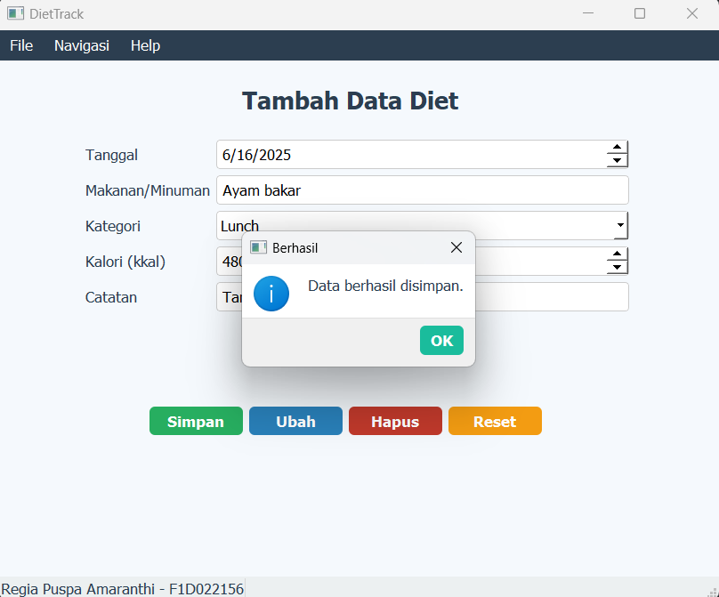 
      <b>Notifikasi Simpan Data</b>
    </td>
    <td align="center">
      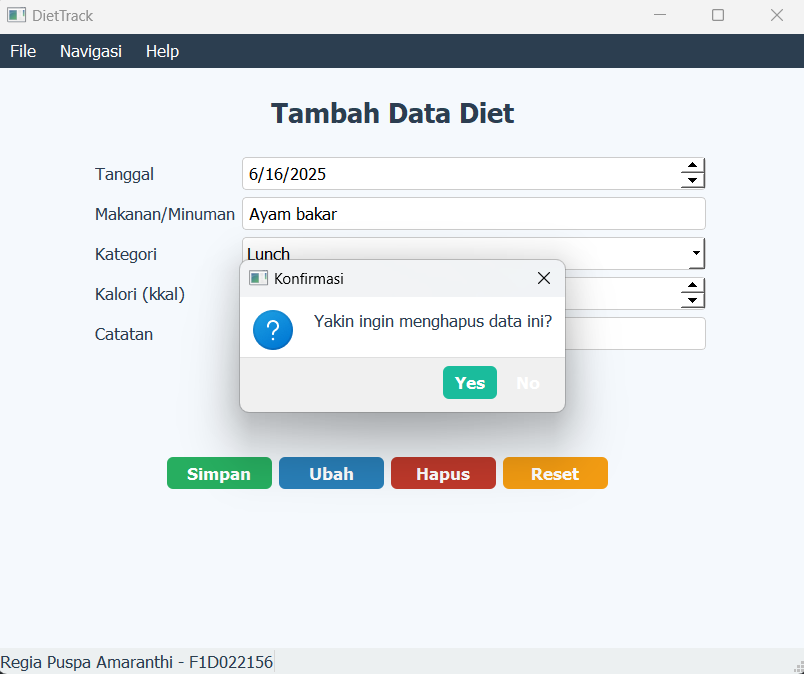 
      <b>Validasi Hapus Data</b>
    </td>
  </tr>
  <tr>
    <td align="center">
      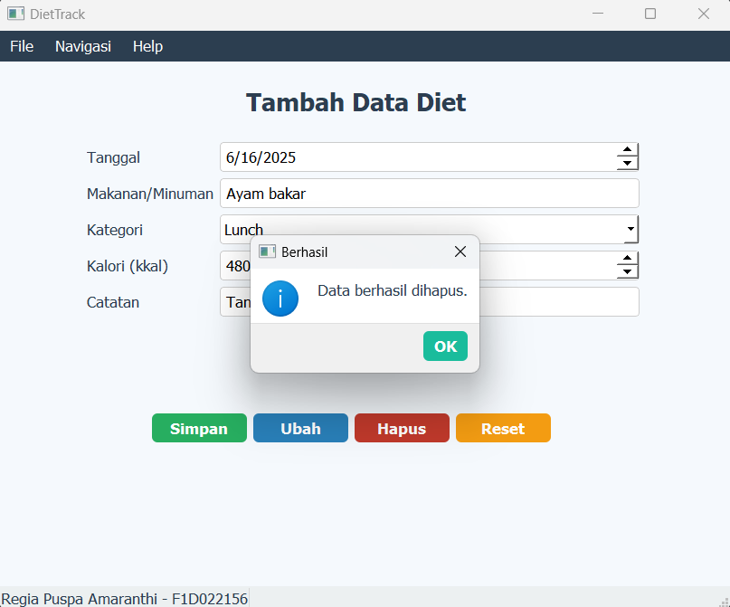 
      <b>Notifikasi Hapus Data</b>
    </td>
    <td align="center">
      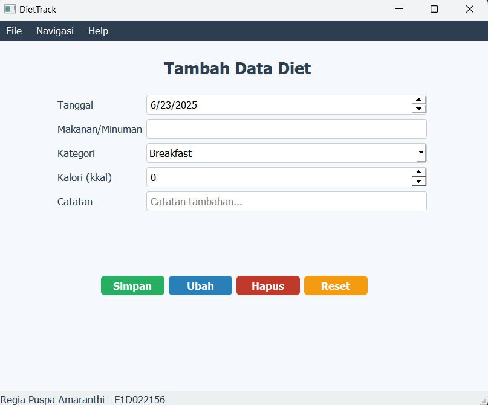 
      <b>Reset Data</b>
    </td>
  </tr>
  <tr>
    <td align="center">
      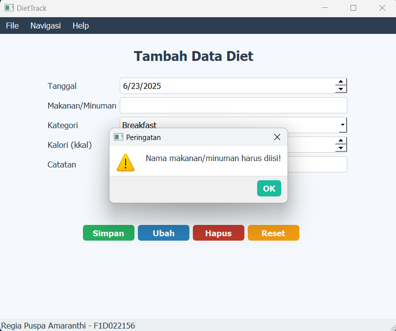 
      <b>Notifikasi Input Kosong</b>
    </td>
    <td align="center">
      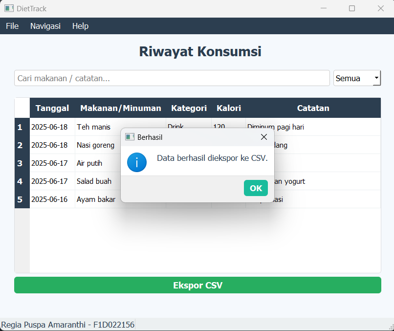 
      <b>Notifikasi Ekspor CSV</b>
    </td>
  </tr>
  <tr>
    <td align="center">
      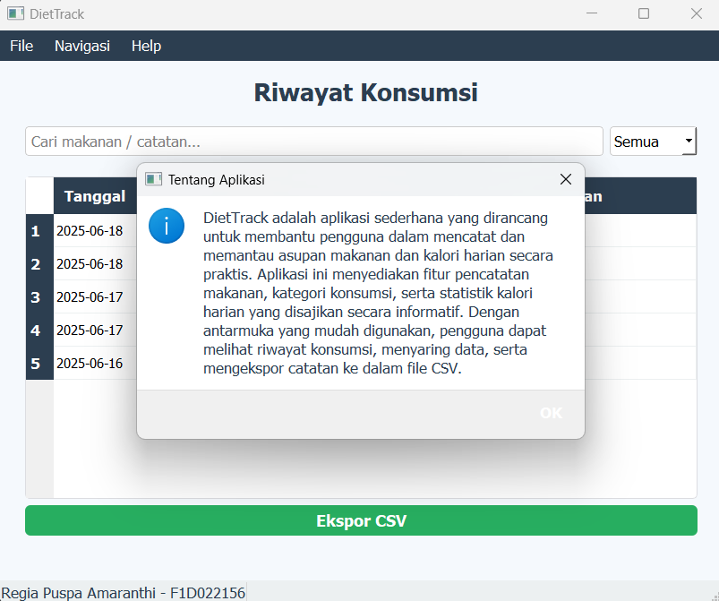 
      <b>Tentang Aplikasi</b>
    </td>
    <td align="center">
      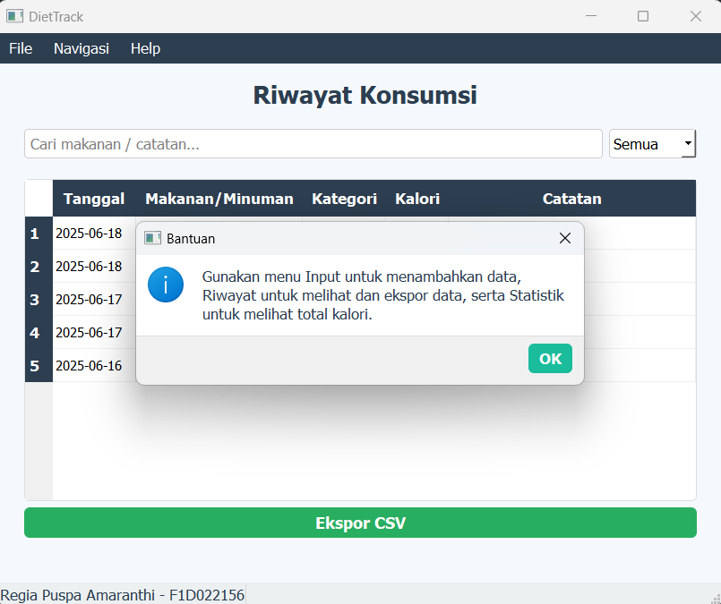 
      <b>Bantuan</b>
    </td>
  </tr>
  <tr>
</table>
